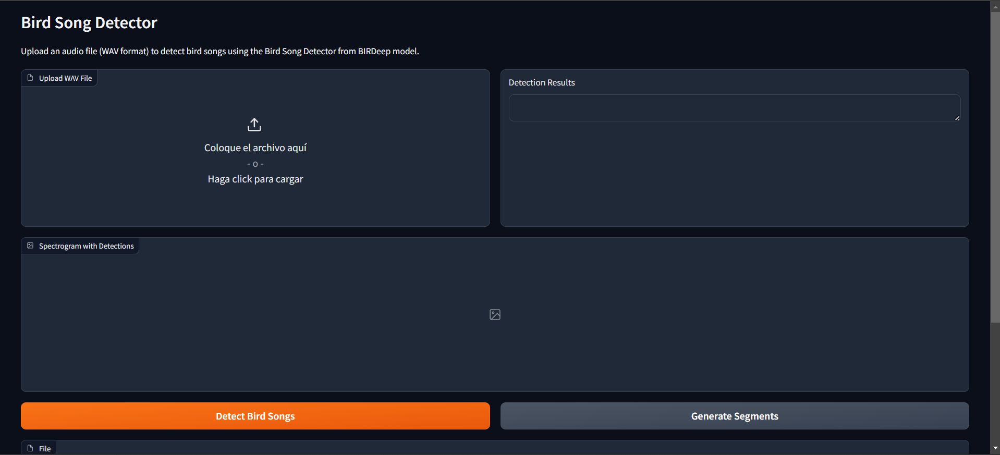
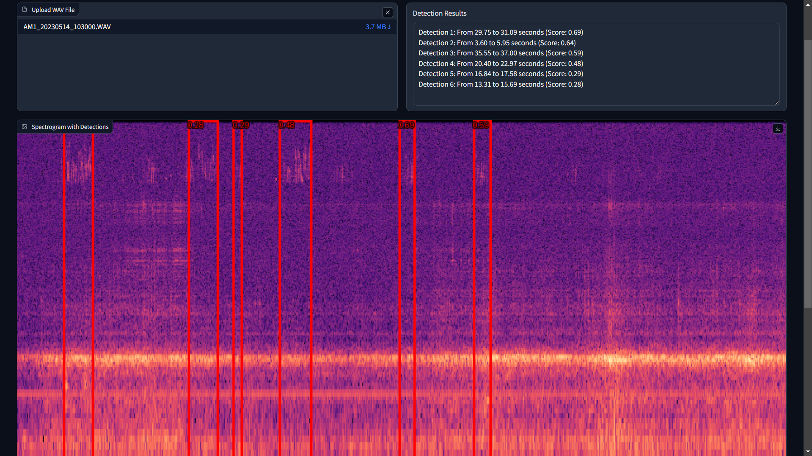
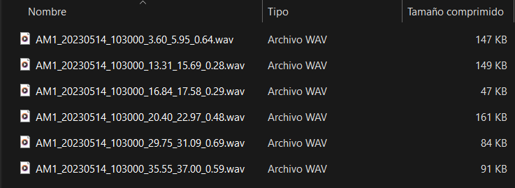

# Bird-Song-Detector

[](https://doi.org/10.5281/zenodo.15019122)

**Bird-Song-Detector** is part of a research to improve bird vocalization identification. The Bird Song Detector is designed to detect bird vocalizations in audio files using a YOLO-based model from the [BIRDeep project](https://github.com/GrunCrow/BIRDeep_BirdSongDetector_NeuralNetworks). The system converts audio files into spectrogram images, performs bird song detection on these images, and transforms the predictions into time segments.

The model has been trained on the [BIRDeep dataset](https://huggingface.co/datasets/GrunCrow/BIRDeep_AudioAnnotations), which consists of audio recordings from **Doñana National Park**, located in Huelva, Spain. As such, the detector is particularly well-suited for identifying bird songs from this region and has not been tested on data from other areas.

For more information, visit the full [BIRDeep Bird Song Detector repository](https://github.com/GrunCrow/BIRDeep_BirdSongDetector_NeuralNetworks).

This repository is part of the manuscript *"A Bird Song Detector for Improving Bird Identification through Deep Learning: A Case Study from Doñana"*, which is currently under review.

## Project Structure

The project is structured as follows:

```plaintext
App/                        # Application code
    assets/
        images/             # Images for README and documentation
Code/                       # Core code files
    audio_processing.py     # Functions for processing audio files
    predict_on_audio.py     # Script to predict bird songs in a single audio file
    predict_on_folder.py    # Script to predict bird songs in all audio files in a folder
Data/                       # Data directory
    Audios/                 # Sample audio files (place your own here)
    Images/                 # Spectrogram images generated from audio files
    Segments/               # Directory for detected audio segments
flagged/                    # Generated files from the Gradio app
Models/                     # Model directory
    Bird Song Detector/     # YOLO model
    BirdNET FineTuned BIRDeep/  # Fine-tuned YOLO model
README.md                   # This README file
environment.yml             # Conda environment specification
```

## Setup

1. Clone the repository:

    ```sh
    git clone https://github.com/yourusername/Bird-Song-Detector.git
    cd Bird-Song-Detector
    ```

2. Create and activate conda environment from environment.yml:

    ```sh
    conda env create -f environment.yml
    conda activate bird-song-detector
    ```

3. Install dependencies:

    ```sh
    pip install -r requirements.txt
    ```

## Usage

### Detect Bird Songs in a Single Audio File

Run the script [predict_on_audio.py](Code/predict_on_audio.py) to detect bird songs in a single audio file:

```sh
python Code/predict_on_audio.py
```

### Detect Bird Songs in Multiple Audio Files

Run the script [predict_on_folder.py](Code/predict_on_folder.py) to detect bird songs in all audio files in a folder:

```sh
python Code/predict_on_folder.py
```

### Web Interface

For a more interactive experience, you can run the Gradio web interface ([app.py](App/app.py)) by executing the following:

```sh
python App/app.py
```

The web interface will be available at `http://127.0.0.1:7860/` by default. On the main page, drag and drop your audio file into the upload box and click `Detect Bird Song` to process it.



Once the detection is complete, you will see the following:

- A list of predicted bird song segments with their start time, end time, and confidence score.
- The corresponding spectrogram image with bounding boxes indicating detected bird songs.



You can then click on the `Generate Segments` button to download a ZIP file containing the individual detected audio segments in WAV format.


The generated ZIP file will contain the predictions WAV format with the name of original audio file followed by the start and end time of the detection and the confidence score.



## License

This project is licensed under the [MIT](LICENSE) License. See the LICENSE file for details.
